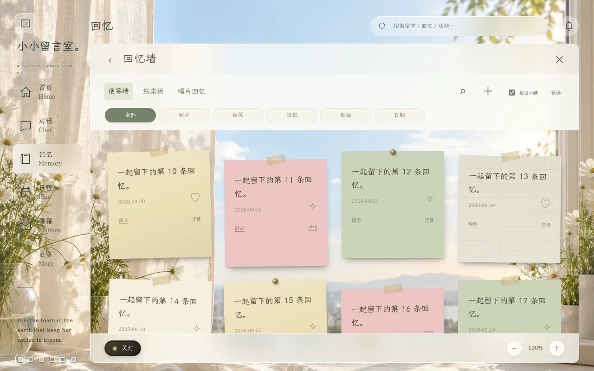
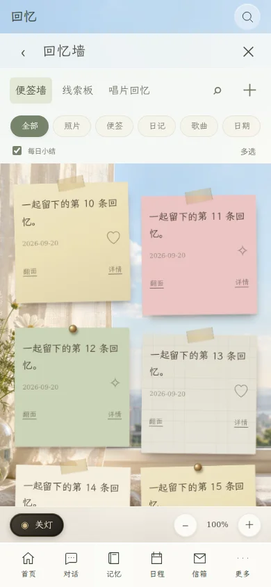

# 整页切换与操作修复 · 2.6.1

参考用户提供的 `1000139001.mp4`：导航保留在左侧，点击后更换整个主内容区域；收起侧栏时内容随之扩展。沿用现有六套主题和各功能的纸张、唱片、窗景材质。

## 使用变化

- 首页、对话、回忆、日程、信箱、更多均占满主内容区域。进入功能后隐藏首页组件，避免两层界面争抢操作。
- 电脑和平板支持文字侧栏与图标侧栏切换，并记住选择。较窄的平板默认使用图标侧栏。
- 手机及低高度横屏保留底部导航，可直接切换功能；导航不会压住页面底部操作。
- 页面使用 130 毫秒淡入，可立即被下一次点击中断。侧栏收展直接调整布局；系统开启减少动态效果时不播放淡入。
- 返回时保留聊天草稿、功能页滚动位置、未完成的编辑表单、回忆画布的位置与缩放；音乐控制器保持同一个实例。
- 从功能页或信箱打开设置，关闭后留在原页面。Escape 先关闭弹窗，再返回功能目录和原页面。

## 减少重复工作

`scene-interface.js` 统一当前页面和导航选中状态，`navigation.css` 负责主区域与导航的尺寸。`ui-v2.js` 切换页面时保留 DOM，隐藏不活跃页面，避免后台控制器把它误判为可见。

日常记录、回忆和纪念日最近成功读取的结果在 15 秒内复用。写入、实时订阅及可见性恢复仍使用原有刷新路径。回忆内容未变且可用宽度未变时保留画布；隐藏时不按零尺寸重新约束缩放位置。

纪念日变动直接通知回忆墙，不再借空消息回调重绘全部聊天。新增、修改和删除的纪念日仍立即反映到回忆墙。

## 实际界面预览

[查看整页切换与侧栏收展录像](previews/navigation-20261004.mp4)

录像来自浏览器运行中的界面，使用隔离测试房间及《飞鸟集》示例留言；没有连接生产数据库。视频保留实际切换时间，静止期间复用捕获的画面。

## 验证

- `npm run check` 通过，62 项单元检查通过。
- 92 项浏览器检查通过：原有核心操作 46 项、日常功能 7 项、导航 4 项、关系空间 3 项、首页 3 项、参考交互 5 项、回忆 4 项、胶片 6 项、一起听 6 项、API 设置 8 项。
- 导航专项检查覆盖 390×844、820×1180、1280×800、844×390；六主题布局检查另覆盖平板横屏和 1440×900 电脑。
- 已预加载房间连续切换 30 次：本轮无界面 Chromium 测试中，单次点击至下一帧中位数 21 毫秒、最大 51 毫秒，未触发重复的日常记录与回忆数据请求。断言验证聊天节点、回忆节点和音频节点保留，以及草稿、表单和缩放值保留。

上述速度是隔离测试环境结果，实际设备、网络和房间资料量会影响体验。本次无需 SQL 迁移。
