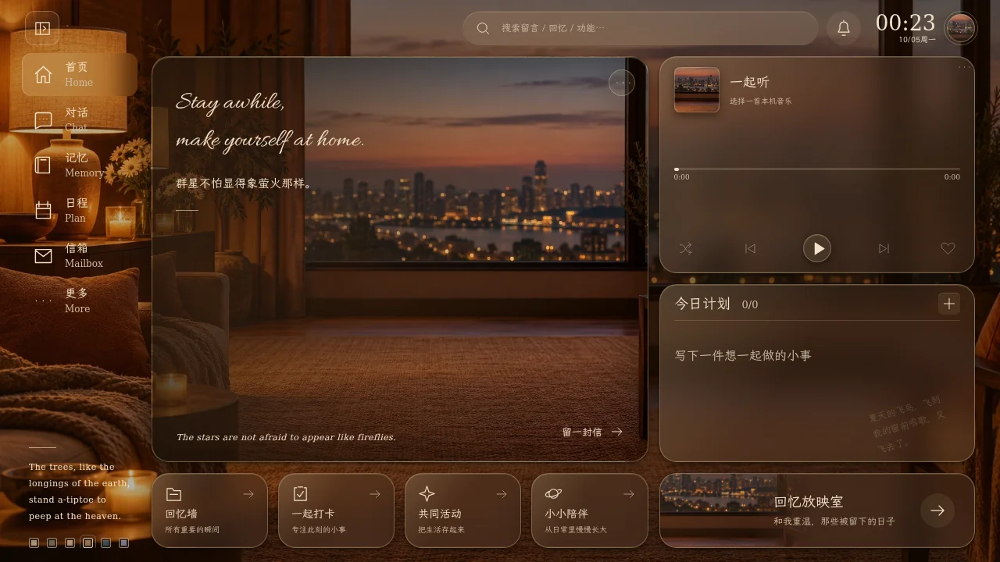
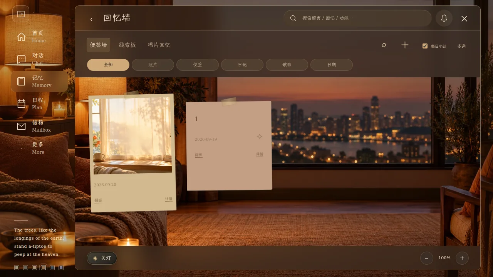
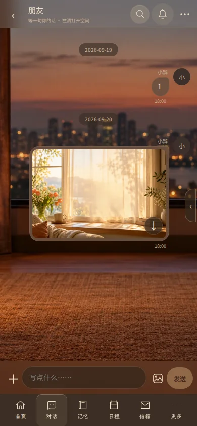

# 页头与留白调整 · 2.6.2

按四张标注图收紧首页、侧栏、功能页与聊天气泡。六套主题沿用同一套尺寸和布局规则。

- 侧栏删除“小小留言室。”及其英文副标题，导航紧接收展按钮并整体上移。
- 对话、回忆墙、信箱与其他功能页移除外层重复标题和空白行；搜索、铃铛放进当前页面标题行，内容向上填满。
- 信箱移除顶部日夜切换按钮。各页面的铃铛继续打开原有主题与通知设置，关闭设置后留在当前页面。
- 首页移除卡片上方的诗句。搜索、时间日期、右侧圆球在同一行；问候卡片和一起听向上扩展。
- 首页标题改为两行花体英文：`Stay awhile, / make yourself at home.`。卡片内有出处的诗句继续沿用原有轮换方式。
- 图片上方不再显示文件名和大小，下载按钮位于图片右下角。短文字与图片气泡缩小内边距，保留原文件下载及有文字时的图片说明。
- 手机搜索展开使用不透明底色，避免下面的标题透出；搜索与铃铛始终可以直接操作。

## 运行界面

以下为隔离测试房间的浏览器实截。图片消息使用仓库中的窗景素材；没有连接生产数据库。

## 验证范围

- JavaScript 语法检查通过，62 项单元检查通过。
- 64 项浏览器检查通过：核心操作 46 项、导航 4 项、首页布局 3 项、参考交互 5 项、一起听 6 项。
- 六主题布局覆盖 1536×1024、1180×630、1024×600、820×1180、390×844、844×390；导航另检查 1280×800。
- 新页头中的铃铛可打开设置；Escape 关闭后仍留在原页面。图片实际下载文件名和内容正常，图片预览保留原节点。
- 1280×720 界面中，搜索、时间日期与圆球的垂直中心一致；单字气泡高约 38 像素，图片上下内边距各 6 像素（含边框）。

上述为桌面 Chromium 的不同视口检查，未代替真实手机或平板验收。本次无需 SQL 迁移，也没有更改依赖版本。

## 字体

英文标题使用本地 Allura，来源为 [Google Fonts / Allura](https://github.com/google/fonts/tree/main/ofl/allura)。原始 TTF 仅转换为 WOFF 容器，未删改字形；随仓库保留 [SIL Open Font License](../assets/fonts/ALLURA-OFL.txt)。不依赖运行时外部字体服务。
