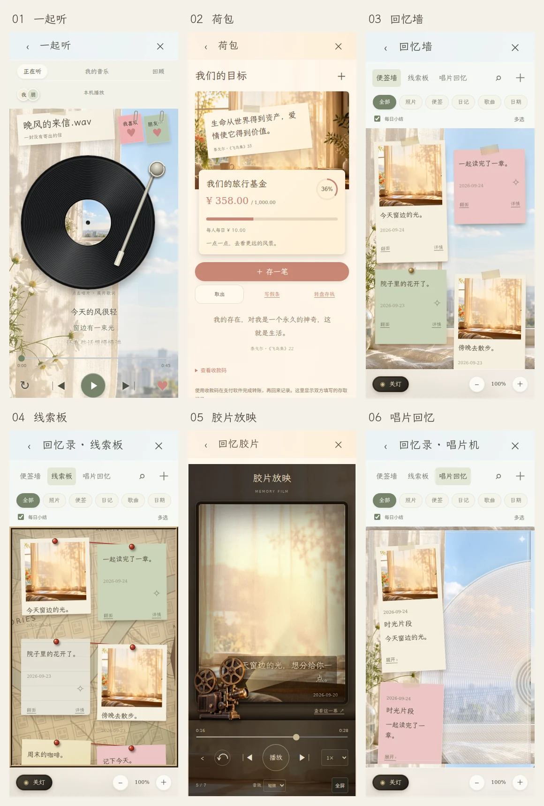
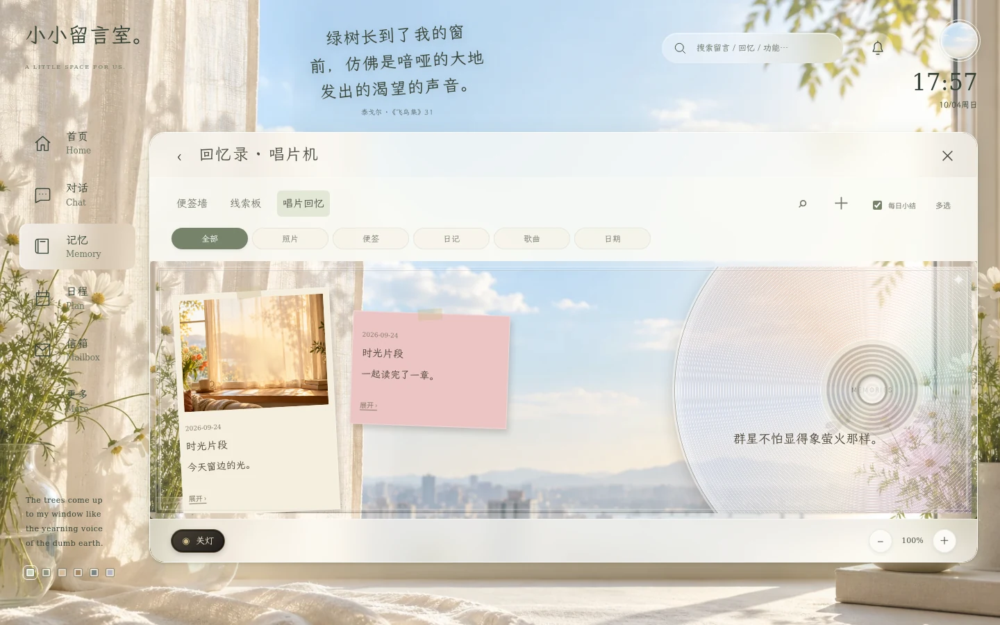

# 2.6.0 · 六个功能参考排版与多端交互

本次在 `update/relationship-space-20261001` 上延续 2.5.1，按用户提供的六张功能图调整实际界面。保留原数据、权限、播放同步、荷包记账及 API 设置；本次没有新增数据库迁移。以下预览是浏览器运行截图，使用隔离测试数据，不是生成的界面效果图。

## 排版对应

| 参考 | 实际界面 | 本次变化 |
| --- | --- | --- |
| 一起听 | 正在听、沉浸歌词、我的音乐、回顾 | 歌曲纸签与两张独立喜欢便签在黑胶上方，金属唱臂、歌词与播放控制在下方；宽屏展开为唱片与播放信息两栏。 |
| 荷包 | 目标首页、创建、存入、今日存钱、请假、取出 | 窗景封面与纸质目标卡；创建分两步；存入使用数字键盘；每日/随心存、24/48 小时冷静期、紧急取出都有对应界面，沿用原服务器规则。 |
| 回忆墙 | 便签墙、详情、翻面 | 按可用宽度排成 2–5 列，纸张、照片、胶带、图钉与错落阴影；详情展示真实原文、附件、标签及背面。 |
| 线索板 | 地图画布、关系连线、手电筒 | 旧地图、图钉及红线；连线来自真实回忆关联；拖动位置保存为相对坐标，兼容旧坐标。 |
| 胶片 | 选择、编辑、放映、倒带、详情 | 竖向带齿孔胶片、帧序号、底部编辑操作、透明放映机前景及光束；放映中查看原回忆会暂停，返回保留同一帧。 |
| 唱片回忆 | 亚克力唱片与卡片 | 透明外壳、右侧局部裁切唱片、左侧照片/便签；唱片尺寸同时适应画布宽高，转动浏览，点击进入详情。 |

Ins 日间/夜间、暖色日间/夜间、雨窗夜色、月光玻璃使用相同组件与响应式结构，主题调整色彩、背景与材质。没有把手机画布固定放大到平板或电脑。

## 手势与页面逻辑

- 便签墙、线索板、唱片回忆支持 50%–250% 双指缩放，也提供放大、缩小和归位按钮；鼠标滚轮平移，Ctrl/Command＋滚轮缩放。
- 第一根手指拖便签或转唱片时，第二根手指加入会先取消未提交的单指动作，再进行缩放，避免误保存位置或误打开详情。
- 手电筒默认直径为画布短边的 34%，可调为 12%–90%；设置保存在本机。改变屏幕尺寸后维持比例，放大画布不会放大光圈。关灯时单指移动光束。
- 功能面板打开后，首页装饰区和聊天区不再接收焦点。搜索、灵动岛、侧栏及弹层按导航状态收起；Esc 只关闭当前最上层。返回聊天保留草稿。
- 缩放按钮栏位于画布之外，聚焦按钮不会使隐藏容器滚动、裁去首排卡片。唱片宽屏直径受画布高度约束，较矮的电脑窗口也能看到唱片中心。
- 保留用户自己的留言、目标说明、歌曲标题和歌词；诗句替换仅用于应用装饰文案。

## 诗句来源与刷新

`poetry.js` 收录泰戈尔《飞鸟集》的 25 则原作及郑振铎译文：1、2、3、4、6、9、10、13、16、18、20、22、24、25、28、30、31、33、35、36、39、41、42、48、54。第 1、3、54 则采用完整句子的节选并标记“节选”。中文转为简体，英文首字母大小写与引号样式统一，未自行编造引文。

- 中文：[维基文库《飛鳥集》](https://zh.wikisource.org/wiki/飛鳥集)，郑振铎译（1922）。
- 英文：[Project Gutenberg · Stray Birds](https://www.gutenberg.org/files/6524/6524-h/6524-h.htm)，Rabindranath Tagore（1916）。

首次随机选择，随后每次刷新页面、重新登录、恢复网络，或离开页面超过 30 秒后返回时轮换；切换主题保持当次句子。引用处保留作者、篇号和来源链接，同一次访问的不同位置使用不同篇目。作品及所采用译文均为公版文本。

## 美术资源

继续使用已有的六套本地窗景、纸张及中文手写字体。本次新增：

- `assets/clue-atlas.svg`：代码绘制的旧地图纹理、街道、河流、公园与罗盘，作为线索板背景。
- `assets/skins/projector-v2.webp`：透明背景的复古 16 mm 放映机。使用内置 `image_gen.imagegen` 从文字生成独立物件，透明模式；没有把参考界面截图当背景或素材。生成结果转换为保留透明通道的 WebP 后接入，光束和界面由 CSS/DOM 实现。

放映机生成提示词：

> Use case: product-mockup. Asset type: transparent website foreground for a refined nostalgic memory film player. A single exquisitely realistic vintage 16mm movie projector, antique bronze metal and dark brown hammered metal housing, two large open-spoke metal film reels on top, visible tiny screws, vents, turning knobs, mechanical supports, glass lens pointing to the RIGHT and slightly upward. Three-quarter view of the left side; the complete projector fills the central 85% of a square canvas, small foot at the bottom, reels entirely visible. Beautiful amber rim lighting from front-right, realistic aged metallic patina and soft highlights. Isolated object cutout on genuinely transparent background, including transparent openings through the reels. NO background, no table, no cast rectangle, no words, no lettering, no light beam (beam will be added in CSS), no interface, no frame, no hands. Premium photographic realism suitable for a tactile scrapbook interface.

## 验证范围

| 检查 | 结果 |
| --- | --- |
| `npm run check` | 语法检查通过 |
| `npm test` | 62 项通过 |
| `npm run test:browser` | 46 项通过 |
| `npm run test:memory` | 4 项通过 |
| `npm run test:daily` | 7 项通过 |
| `npm run test:music` | 6 项通过 |
| `npm run test:film` | 6 项通过 |
| `npm run test:skins` | 3 项通过 |
| `npm run test:scene` | 3 项通过 |
| `npm run test:api` | 8 项通过 |
| `npm run test:reference` | 5 项通过 |

共 62 项单元检查和 88 项浏览器集成检查。新增检查覆盖 360/820/1440 px 回忆画布、六主题布局尺寸一致、真实双触点事件、缩放时不保存便签拖动、光圈随屏幕变化、诗句刷新及导航焦点。其他现有套件覆盖手机、平板横竖屏和电脑窗口；浏览器服务请求均已拦截，没有连接生产数据库或实际模型服务。

同时保留 main 上已有的 Pages 打包修复：部署与预览包含浏览器实际依赖的 `supabase/functions/_shared/*.js`，并检查本地导入完整性，避免 API 模块漏发后整页无法初始化。这里只更新工作分支；真实双设备同步、实际手机浏览器触控和上线后外部 API 连通性仍需部署后验收。
