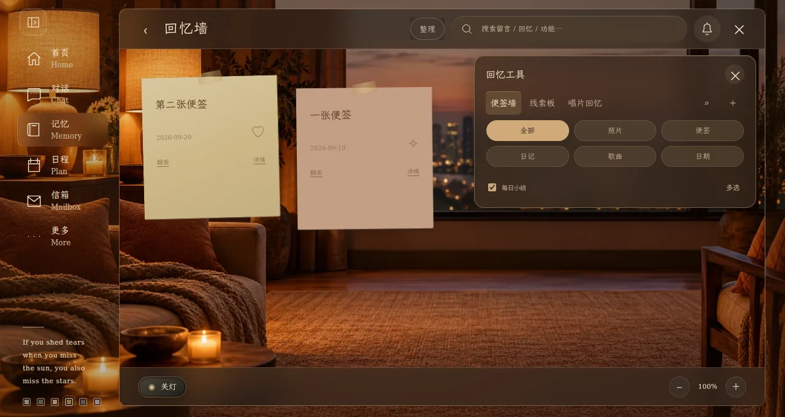
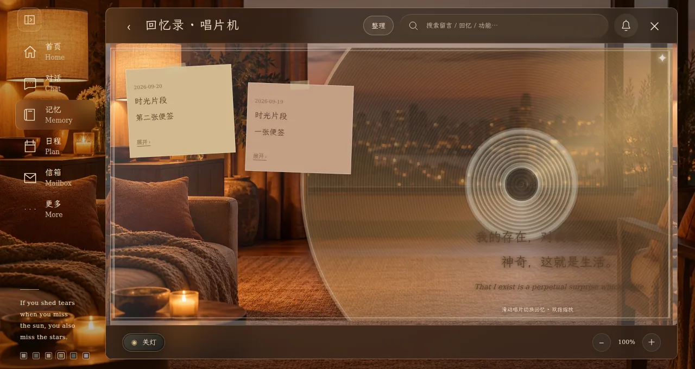
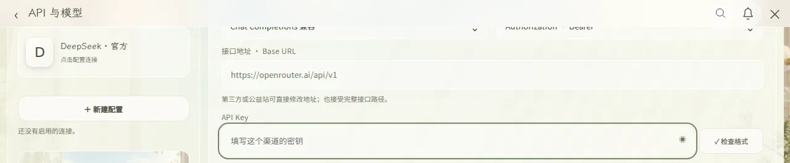

# 触屏、键盘与回忆画布 · 2.7.1

继续更新 PR #8、`update/relationship-space-20261001`，对应 10 月 5 日提交的三张问题截图与短录屏。

## 修复内容

- **我们的空间**：移除底部黄色诗句纸条；头部与可滚动内容使用明确的两行布局，卡片区域允许纵向触屏滚动。离开再返回时恢复空间页自身的位置。
- **聊天跳转**：录屏中的“从信箱点进会话却回首页”在本地复现。原因是打开任何房间都会派发重置首页的事件。现在只有网址初次打开使用首页；点已有会话、加入房间直接进入聊天。侧栏入口仍直接切换。
- **键盘**：根据可见视口高度识别键盘收缩；输入期间隐藏侧栏/底部导航，让内容与输入框使用键盘上方的完整高度。表单滚动到正在编辑的字段，聊天输入栏保持可见。键盘收起后恢复原布局。
- **回忆工具**：视图切换、类型筛选、搜索、添加、每日小结、多选集中到标题栏“整理”面板。默认收起；打开时覆盖画布，不压缩画布高度。点外部、关闭或 Escape 收起；选择其他模式后也自动收起。多选操作和同步失败提示仍直接可见。
- **线索板**：先完成底部工具条布局，再测量画布；按便签的实际宽高限制拖动，不再误用网格行间距。保存相对坐标，宽度或高度改变都会更新布局；坐标转换扣除边框，缩放后仍跟随手指。双指缩放仍会取消第一根手指的便签拖动。

六套主题继续共用布局与现有材质。无数据库迁移。

## 实际浏览器截图

截图使用隔离测试房间与测试文字，没有写入生产数据库。

以下是模拟键盘占用高度后，浏览器剩余可用区域的截图，不含操作系统键盘：

## 验证范围

- `npm run check`：浏览器模块语法检查。
- `npm test`：64 项单元测试。
- `npm run test:touch`：7 组回归，包括 CDP 触屏滑动/点击、两种视口收缩方式、会话跳转、六套主题工具面板、改变尺寸/缩放后拖动四角、旧房间兼容。
- `npm run test:browser`：46 项原有聊天、发送、媒体、鉴权、通知、导入与交互检查。
- `npm run test:reference`、`npm run test:navigation`、`npm run test:memory`、`npm run test:film`：原有回忆、缩放、侧栏、胶片选择与播放流程。

浏览器测试全部拦截 Supabase 请求。触屏事件由 Chromium 执行；软键盘通过视口收缩模拟，尚未在用户的 vivo Pad Air 实机上验证。
