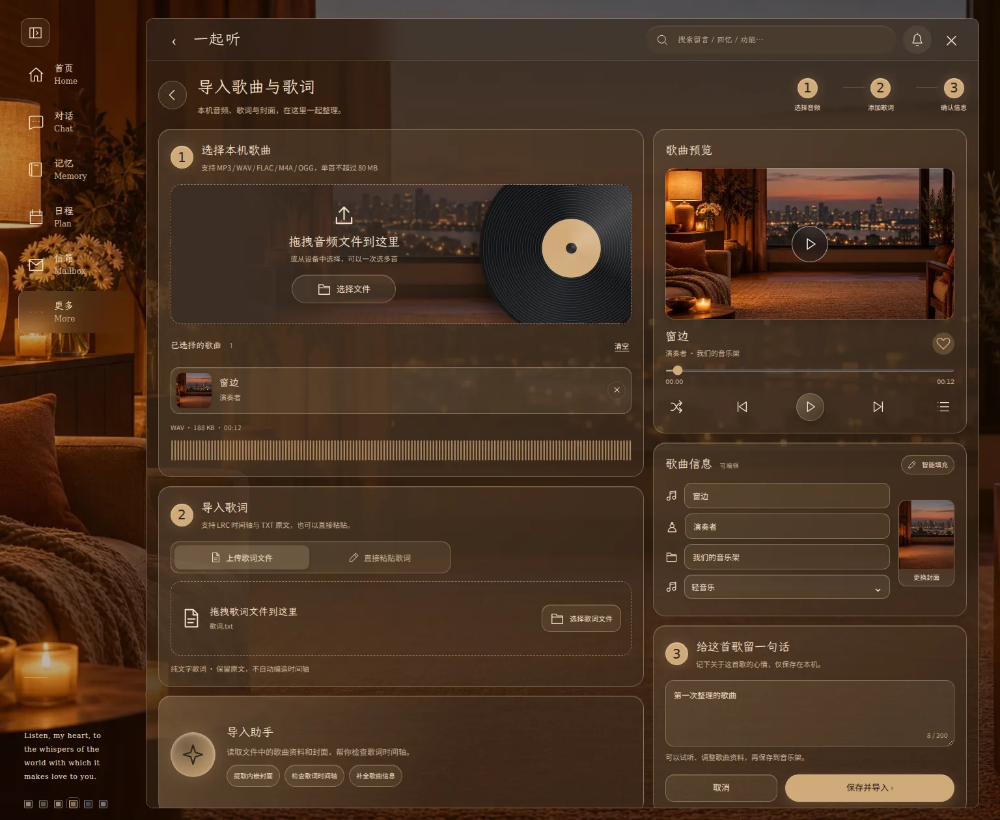
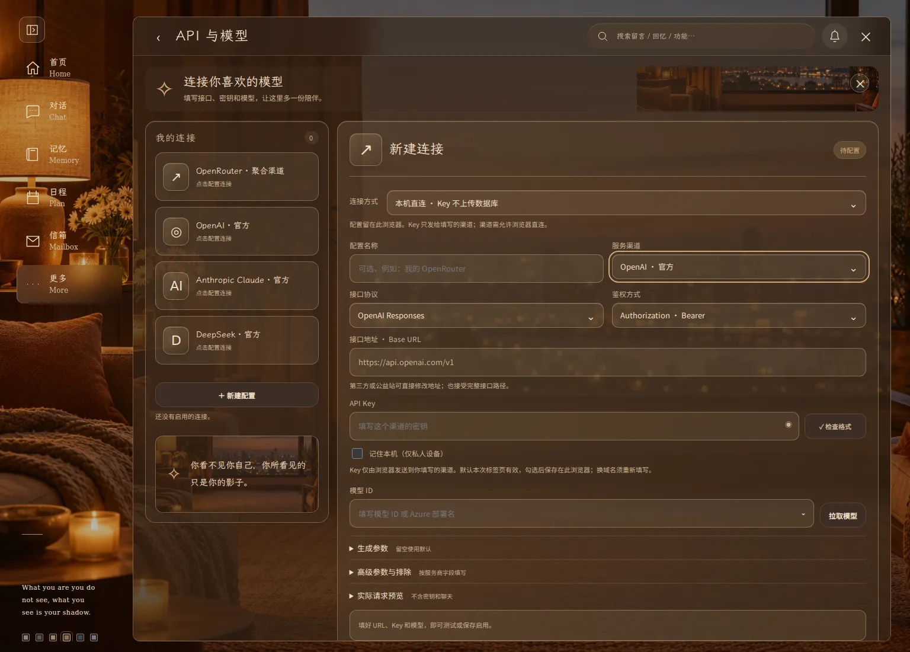
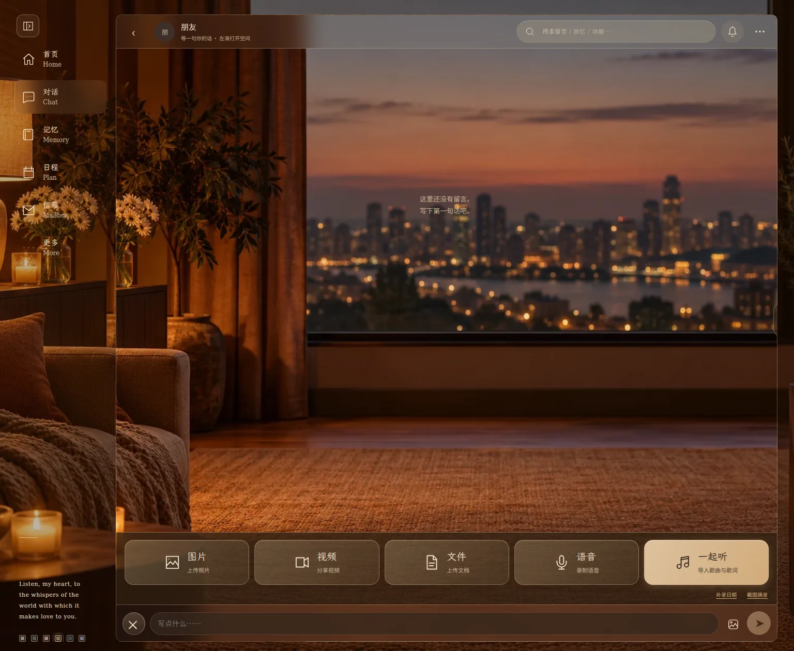
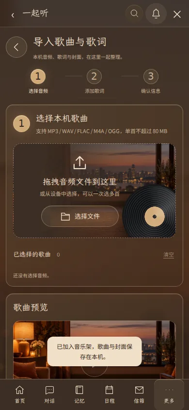
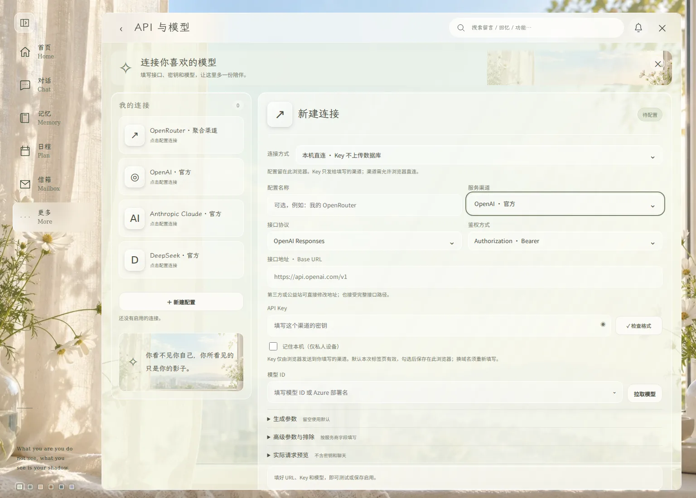
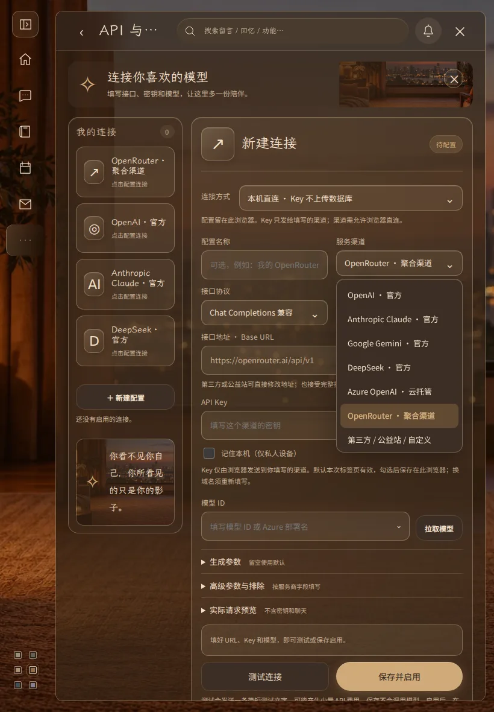

# 音乐导入、API 与附件栏 · 2.7.0

按本轮 P3、P4、P5 参考图调整实际操作界面。所有页面共用六套主题的布局；颜色、窗景、玻璃、边缘光与按钮跟随当前主题。沿用 PR #8 和原工作分支。

## 本轮变化

- 一起听只保留导入入口，点击后进入独立工作台。可批量选择或拖入音频，试听、查看真实波形、切换歌曲、选择封面、编辑标题/艺术家/专辑/风格、收藏、添加备注，确认后保存到本机音乐架。取消不保存文件。
- 歌词支持 LRC/TXT 上传、拖入、直接粘贴。检查时间标签顺序、重复及超出时长；无时间轴的文字保留原文。旧版本机歌词与备注可在导入页展开查看。
- API 改为左侧连接列表、右侧配置表单。可新建多渠道连接、选择本机或账号同步、显示/隐藏 Key、检查格式、拉取/搜索模型、测试及保存启用。详细参数、额外 JSON、字段排除和请求预览均保留。
- 聊天的加号打开图片、视频、文件、语音、一起听五项工具栏。图片/视频/文件调起对应选择器；语音录制后仍需确认发送；一起听直接进入导入页。补录日期与截图摘录仍可使用。
- 原生白色选择弹层换成主题列表；模型候选列表也跟随主题。支持键盘、触屏、点击外部收起。
- 信箱移除顶部独立图片和图上文案。

## 切换与启动修复

- 在样式和应用模块执行前同步恢复保存的主题，兼容旧版主题存储的优先顺序。
- 初始房间路由不等待账号和已加入房间列表。侧栏直接打开目标功能页；后台请求完成或报错不会覆盖用户的新选择。
- 已隐藏弹层不重复归还旧焦点；API 作为整页功能使用，侧栏可直接离开，重新进入正常恢复。
- 音频试听离开页面即暂停，导入草稿只在确认后提交；异步结果校验房间与版本，防止切换房间后写进新界面。

## 实际功能边界

音频、封面、专辑、纯文字歌词和备注保存在本机。原有同音源校验、播放同步、歌词、喜欢、共享/私人歌单继续使用原数据服务。本轮无需新增 SQL。

导入助手读取文件名、ID3v2.3/v2.4 标签与内嵌封面，检查已有歌词时间轴。它不向模型上传音频，不提供联网专辑封面搜索，也不把本地规则称作 AI 自动识别。没有时间轴时不编造逐句时间。

本机 API Key 不上传数据库；直接请求仍取决于渠道的浏览器跨域支持。检查格式不会验证密钥是否有效，真实调用由“测试连接”触发。账号同步模式沿用原有服务端配置要求。

## 浏览器实截

截图来自隔离测试房间，音频为测试波形，封面采用仓库现有窗景。没有写入生产数据库。

## 验证

- `npm run check`：全部模块语法检查通过。
- `npm test`：64 项通过，包含 ID3 边界和歌词检查。
- `npm run test:browser`：46 项通过，覆盖聊天、身份、附件、录音、同步播放、旧数据恢复与截图导入。
- `npm run test:music`：6 项通过，覆盖音乐架、歌词、双人喜欢、歌单、统计及恢复。
- `npm run test:api`：8 项通过，覆盖两种连接模式、模型列表、字段排除、Key 保存边界和服务失败。
- `npm run test:reference`：5 项通过，覆盖回忆缩放、光束、诗句和焦点顺序。
- `npm run test:navigation`：4 项通过，连续切换无冗余数据请求；该次测试中位数 23 ms，最大 43 ms，不代表所有设备性能。
- `npm run test:workspace`：4 组通过。六主题分别在 390×844、820×1180、1536×1100 检查；覆盖上传前取消、真实试听和波形、封面与备注恢复、收藏增删、模型列表触屏/键盘选择，以及阻塞应用模块和房间请求时的主题、导航行为。

浏览器测试拦截了后端与第三方模型请求。真实设备的系统选择器、麦克风许可和用户自配模型渠道，仍取决于设备及服务商条件。
